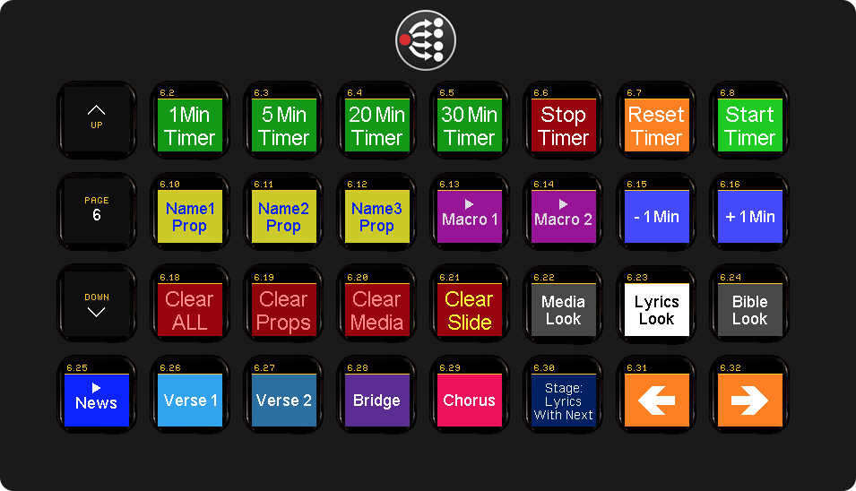
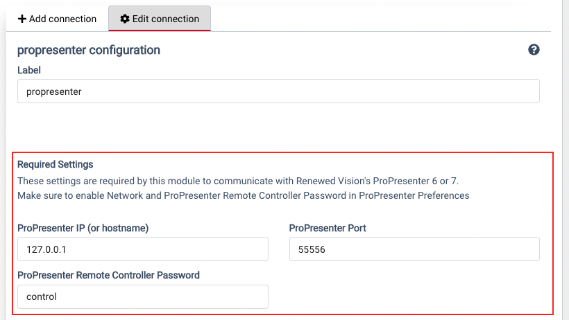
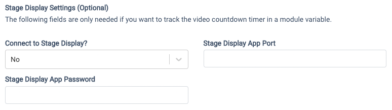
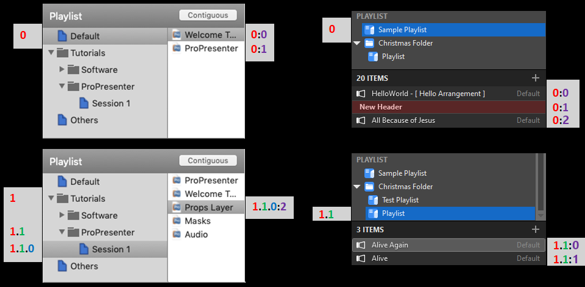
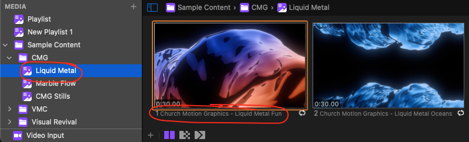

# Companion-module: ProPresenter6/7

This Companion module allows you to remotely control ProPresenter 6 or 7 with the Elgato Stream Deck.
Using this Companion module, each LCD button on your Stream Deck can be setup with custom text (or images) and ProPresenter actions. 

> See <a href="https://github.com/greyshirtguy/companion-module-renewedvision-propresenter/blob/master/README.md" target="_blank">README.md</a> for latest version history and instructions to report issues. 

 
_Example. (You can also use Companion without a Stream Deck through it's web buttons/emulator)_

## Configure ProPresenter To Be Controlled By Companion:
This Companion module will connect to ProPresenter via a network connection (using the same connection that the official mobile remote app uses).
You can run Companion on the same computer as ProPresenter itself or on different computer(s) on the same network.

1. Open ProPresenter and then open the "ProPresenter" Menu.
2. Select "Preferences..." to open the ProPresenter Preferences window.
3. Select the Network tab to configure ProPresenter network preferences.
4. Check the "Enable Network" option (if it is not already enabled).
5. Check the "Enable ProPresenter Remote" option (if it is not already enabled).
6. Check the "Controller" option (if it is not already enabled).
7. Enter a controller password (or take note of the existing controller password).
8. Take a note of the Port number and IP Address.
    > Tip: If you want to connect to ProPresenter on the *same* computer that you are running Companion on, you can use the special loopback IP address of 127.0.0.1 *Older versions of ProPresenter do not show the IP address. Use your knowledge of networking (or Google how) to get the IP address (or hostname) of the computer running ProPresenter*.
9. If you would like your Stream Deck to be able to display "Video CountDown" timers, then you will also need to check the option for "Enable Stage Display App" and enter a new password (or take note of the existing password).
10. Some of the newer actions in this module require the new network "Link" (Pro7.8+) to also be enabled (you don't need to join any group - just enable Network Link)
    > The items in red are bare minimum to get Companion working with ProPresenter 6/7.  The items in orange are optional extra settings that enable more features and actions in this module:
    

### Performance Tip
If the computers running ProPresenter and Companion are separate computers and they have the option of using either a wireless or a wired network connection, then it is recommended to use a wired network connection whenever possible. This is because a wired network connection is *typically* more reliable and has better latency - which is nice for remote control.

## Configure the ProPresenter module in Companion
Now you have all the info you need to go to the ProPresenter Companion module configuration and enter the IP address of the computer running ProPresenter as well as the ProPresenter port number and controller password that you took note of from ProPresenter network preferences. 
 

If you chose to also enable the stage display app option in ProPresenter preferences (so your StreamDeck can display "Video Countdown" timers) then you can also select "Yes" for the configuration field "Connect to StageDisplay (Only required for video countdown timer)" and enter the stage display password. 
 
> N.B. At the time of writing this module, there is a bug in ProPresenter 6 where if you choose to enter a Port number for the stage display app - it will actually ignore it and use the "main" network port you recorded in step 8 above.

_🎹 Optional MIDI Listener_  
There is an optional MIDI listener to enable remote control of Companion through MIDI.  If you enable this option, you can send a Note-On message to Companion to cause a remote button press.  The numerical value of the note will specify the page of the button to press and the intensity of the note will specify the button to press on that page. On MacOS the portname will be the Device Name + a space + the Port Name. For Example: If you were using the IAC Driver with the default device name of "IAC Driver" and with a custom port named "Pro7Companion", the full portname would be "IAC Driver Pro7Companion"

_**⚠️ Pro7/Windows users ⚠️**  
Currently there is a noticeable performance impact on Pro7/Windows when companion sends messages to Pro7 to track info about the current presentation. To work around this, there is now a new option called "Send Presentation Info Requests To ProPresenter" in the module configuration where you can optionally turn that off.  Doing so will remove the performance impact (random lag when changing slides) but will stop updating the dynamic variables: remaining_slides, total_slides or presentation_name.  You will no longer be able to display them on buttons. 
However, there is also another option to configure the **type** of the presentation request.  Pro7 users on Windows may find using the "Manual" type works well enough on their system without impacting performance - enabling them to leave the Send Presentation Info Requests To ProPresenter enabled and enjoy the extra dynamic variables it provides._

# Actions (Commands) - What can you do with ProPresenter?
## Slides
Command | Description
------- | -----------
Next&nbsp;Slide | Advances to the next slide in the current document. If at the end of a document, will advance to the start of the next document in the playlist.
Previous&nbsp;Slide | Moves to the previous slide in the current document. If at the start of a document, will move to the start of the previous document in the playlist.
Specific&nbsp;Slide | Moves to that presentation/slide number. Supports variables as inputs. See the `Notes About Specific Slide` section below.
Specific Slide With Label | Trigger a specific slide by Playlist name, Presentation name and Slide Label. _Give a custom label to any slide and you can trigger it!_
Specific Slide In A Group | Trigger a specific slide of a given Group Name (eg Slide 1 of the group "Chorus"). Defaults to the current presentation - but you can specify a specific presentation if you want. _You need to click a slide in a presenation to make that presentation "Current" - Simply selecting a presentation without clicking any of its slides will NOT make it current._ 
Specific Slide (Network Link) | Trigger a specific slide by Playlist name, Presentation name and Slide Index. (Requires Pro7.8+ with Network Link enabled)

> ### Notes About Specific Slide
> This action has two parameters:
> 
> **Slide Number**: Moves to the slide number specified.
> 
> A whole number greater than 0 will move the presentation to that slide number.
> 
> A slide number of `0` will trigger the current slide, which can be used to bring back a slide that was cleared using `Clear All` or `Clear Slide`.
> 
> A relative number (prefixed with `+` or `-`) will move the presentation +/- that many slides. `+3` will jump ahead three slides, and `-2` will jump back two slides. Try to avoid using `-1` or `+1` relative numbers; use the `Next Slide` and `Previous Slide` actions instead, as they perform better.
> 
> **Presentation Path**: Lets you trigger a slide in a different presentation, even from a different playlist.
> 
> *Important: Presentation path numbering starts at 0, meaning `0` will trigger a slide in the first presentation in the playlist.*
> 
> A single number, like `3`, will let you trigger a slide in the *fourth* presentation in the **current playlist**.
> 
> A path like `1:3` will trigger presentation #4 in playlist #2.
> 
> Note that you can use Companion custom or module variables in the Slide Number and Presentation Path fields.
> 
> Playlists in groups (or nested groups) are identified using periods. `1.1.0:2` means "The second playlist is a group. The second item in that group is another group. Select the first playlist in that group. Choose the third presentation in the playlist."
> 
> The below image may make this more clear:
> 
> 
> 
> Note: When indexing presentations in a playlist to determine the presentation path value, you must also include/count any headers. 
> 
> Example Playlist:
> 
> * Header A (index=0)
>   * Presentation A (index=1)
> * Header B (index=2)
>   * Presentation B (index=3)
>   * Presentation C (index=4)

## Pro7 Looks
Command | Description
------- | -----------
Pro7&nbsp;Set&nbsp;Look | Choose a Look to set live in Pro7. _The list of Looks is updated after you have connected to Pro7._  👀 Feedback is available to change button colors when a specific Look is live.

## Pro7 Macros
Command | Description
------- | -----------
Pro7&nbsp;Trigger&nbsp;Macro | Choose a Macro to trigger in Pro7. _The list of Macros is updated after you have connected to Pro7._

## Audio Cues
Command | Description
------- | -----------
Audio&nbsp;Start&nbsp;Cue | Start a specific audio cue in an audio-bin playlist.  Uses the same numerical format to specify the path of the audio item (see Presentation Path explanation above)
Audio&nbsp;Play/Pause | Pause (or resume playing) the currently playing (or paused) audio.
Trigger Audio (Network Link) | Trigger any audio in the audio bin using audio Playlist Name, and _either_ the Index or Name of the audio file. If you specify both, Index will be used. (Requires Pro7.8+ with Network Link enabled)

## Clear/Logo
Command | Description
------- | -----------
Clear&nbsp;All | Clears all the layers
Clear&nbsp;Audio | Clears the audio track
Clear&nbsp;Background | Clears only the background layer
Clear&nbsp;Slide | Clears the current slide (foreground and background)
Clear&nbsp;Telestrator | Clears all annotations drawn with the telestrator
Clear&nbsp;to&nbsp;Logo | Clears all the layers and shows the logo image set in ProPresenter
Prop Clear (Network Link) | Clear a Prop, specified by _either_ the Index or Name of the Prop. If you specify both, Index will be used. (Requires Pro7.8+ with Network Link enabled)
Message Clear (Network Link) | Clear a Message, specified by _either_ the Index or Name of the Message. If you specify both, Index will be used. (Requires Pro7.8+ with Network Link enabled)

> ### Clear All Notes
> Note: For some versions of ProPresenter, when the `Clear All` action is triggered against ProPresenter for Windows, the current slide will be lost but on Mac it's preserved.
> 
> For example, if you're on slide #5, trigger `Clear All`, and then trigger `Next Slide`:
> - On Mac you'll be on slide #6
> - On Windows, you'll be on slide #1
> 
> You can work around this PC limitation by using the `Specific Slide` action with a relative slide number of `+1` to move to the next slide. This would move you to slide #6 after the `Clear All` action.

## Messages (On Output screen)
Command | Description
------- | -----------
Show&nbsp;Message | Shows the message on the stage display output. You can pass values for message tokens, but you must do so very carefully - a typo here can crash ProPresenter.  Crashes can cause data loss, and ruin your setup. Learn how to correctly enter message tokens by reading below. Always type carefully and double-check. Get it right on a test machine first! The correct way to pass values for message tokens is as two lists. The two lists work together to form token NAME and token VALUE pairs.  The first list is a comma-separated list of token NAMES and the second is a comma-separated list of token VALUES. The number of items in each list should match - e.g. if you supply two token NAMES, then you should supply two token VALUES to make matching pairs. All token names in your list *MUST* match the token names defined in the message within ProPresenter (or else Pro6 will likely crash).  The token values can be any text. You don't have to pass *all* the token names/values pairs - any name/values that you don't include will be treated as and displayed as blank. You don't have to pass any token names/values if you don't need to. Static messages without any tokens are safe - you can't make a typo if you leave the token names and token values list blank! If one of your token names or token values needs to have a comma in it, you can type a double comma (,,) to insert a literal comma - this works in either a token name or a token value. Again, make certain that your list of token NAMES perfectly match the names of the tokens defined in the message within Pro6 - Pro6 won't crash if they match perfectly - so be careful! Note that you can use a single Companion custom or module variables in the Token values field.
Hide&nbsp;Message | Removes a message from output screen.

> Messages are identified by Index. Index is a 0-based, where the first message is 0, and then count up through the messages in the order shown in the list of ProPresenter messages.

## Stage Display
Command | Description
------- | -----------
Stage&nbsp;Display&nbsp;Message | Shows the message on the stage display output
Stage&nbsp;Display&nbsp;Hide&nbsp;Message | Removes the stage display message
Stage&nbsp;Display&nbsp;Layout | Sets the stage display layout for a selected stage screen. 👀 Feedback is available for the active stage display on each stage screen (and the watched stage screen if configured).

> In Pro6 Stage Displays are identified by index. Index is a 0-based number, where the first layout is 0 and then count up through the stage display layouts in the order shown in ProPresenters list of stage display layouts.
> In Pro7 you can choose which screen and which stage display layout you want to set by name. (The dropdown list of name is NOT refreshed until after you have connected to PRo7).

## Clocks (Timers)
Command | Description
------- | -----------
Start&nbsp;Clock | Starts clock (timer) - identified by index (0 based)
Stop&nbsp;Clock | Stops clock (timer) - identified by index (0 based)
Reset&nbsp;Clock | Resets clock (timer) - identified by index (0 based)
Update&nbsp;Clock | Update clock/timer with a new duration - identified by index (0 based). You must specify the Name and Type of clock in an update action - as they always update the clock. Countdown durations etc are entered in format HH:MM:SS. You can optionally add a + or - prefix to add or subtract time to/from the current time of the clock.  You may also use a shorthand format if you like. You can, if you want, leave out the HH and/or the MM values and they will default to zero - you can also leave out one or both of the ":" to enter just mins and/or seconds.  You can control overrun for all clock types.  AM/PM is only needed for Countdown To Time clocks.

> **Tip: One-Touch Preset CountDown Timers.**
> If you use a lot of timers with commonly used values for duration, you might like to setup a few buttons that automatically reset and restart a count-down timer for your most commonly used durations. To make a single button do that for you, you can chain together the following three actions:
> 1. *Update CountDown Clock* - Set new duration value of the count-down timer. This new value will be used when the timer is next reset.
> 2. *Reset Clock* - Stop the count-down timer if running and reset current value back to duration. You  might like to add a little delay (say 100-300ms) to ensure > ProPresenter has time to process previous action.
> 3. *Start Clock* - Start the count-down timer running. You might like to add a little delay (say 100-300ms) to ensure ProPresenter has time to process previous action.
> 
> Use increasing delay amounts (or relative delays) to ensure these three actions arrive in the correct order.

## Props, Media Bin and Audio Bin
Command | Description
------- | -----------
Prop Trigger (Network Link - Beta)  | Trigger a specifc Prop using _either_ the Index or Name of the Prop. If you specify both, Index will be used. (Requires Pro7.8+ with Network Link enabled) 
Trigger Media (Network Link - Beta) | Trigger a specific Media Item by Playlist name and _either_ the Index or Name of the Media. If you specify both, Index will be used. (Requires Pro7.8+ with Network Link enabled).
Trigger Video Input (Network Link - Beta) | Trigger a specific Video Input by _either_ the Index or Name of the Video Input. If you specify both, Index will be used. (Requires Pro7.8+ with Network Link enabled)

> The name of an item in the Video Input Bin is the name under the thumbnail in the bin. (Right-click to rename) 
>  
> 
> The name of an item in Media Bin is the name under the thumbnail in the bin. (Right-click to rename) 
>  
> The playlist name is on left.

## Timeline
Command | Description
------- | -----------
Timeline&nbsp;Play/Pause | Toggle play/paused state of timeline for a specific presentation (See PresentationPath explanation above)
Timeline&nbsp;Rewind  | Rewind timeline for a specific presentation (See PresentationPath explanation above)

> Please Note: There is NO direct feedback from ProPresenter for when a timeline is playing or paused - so this cannot be shown to users on the StreamDeck!

## Custom Actions (Support Use Only)
Command | Description
------- | -----------
Custom Action | Send custom JSON to remote websocket (Support use only)
Custom Action (Network Link - Beta) | Send custom JSON to custom endpoint (Pro7.8+ with Network Link enabled. Support use only)

# Dynamic Variables
Variable | Description
-------- | -----------
$(propresenter:current_slide) | The number of the active slide (>= 1), or "N/A" if unknown.
$(propresenter:current_presentation_path) | The presentation path of the current presentation.
$(propresenter:total_slides)  | The total number of slides in the current document, or "N/A" if unknown.
$(propresenter:presentation_name) | The name of the current presentation, or "N/A" if unknown.
$(propresenter:current_announcement_slide) | The number of the active slide on announcements layer (>= 1), or "N/A" if unknown.
$(propresenter:current_announcement_presentation_pathh) | The presentation path of the current presentation on announcements layer
$(propresenter:connection_status) | The current connection status to ProPresenter ("Disconnected" or "Connected").
$(propresenter:watched_clock_current_time) | In the config of this module, you can specify the index of a clock (timer) that you want to "watch". This dynamic variable will be updated once per second to the current value of the clock specified. You could use this to display a live timer value on a button!
$(propresenter:current_stage_display_index) | Index of the currently selected stage display layout (This is updated whenever a new layout is selected.)
$(propresenter:current_stage_display_name) | Name of the currently selected stage display layout (This is updated whenever a new layout is selected.)
$(propresenter:video_countdown_timer) | Current value of video countdown timer - automatically updated when a video is playing. (This one variable is only updated when the module is configured to also connect to the Stage Display App port)
$(propresenter:current_pro7_stage_layout_name) | The name of the current stage-display layout on the selected stage-display screen (as set in module config)
$(propresenter:*StageScreenName*_pro7_stagelayoutname) | The name of the current stage-display layout on the stage screen with name: "stageScreenName" (Case Sensitive)
$(propresenter:pro7_clock_n) | hh:mm:ss for clock with index n
$(propresenter:pro7_clock_n_hourless) | mm:ss for clock with index n
$(propresenter:pro7_clock_n_totalseconds) | total seconds for clock with index n (can use this for feeback - eg update button colour when clock time <0)
$(propresenter:current_random_number) | Current random number (update to new random number with action "New Random Number")
$(propresenter:time_since_last_clock_update) | Number of milliseconds since module last heard a clock update message from ProPresenter. Normally sent every 1000ms. If none are received for longer than say 3000 milliseconds, then the connection has probably failed.
$(propresenter:connection_timer) | Number of seconds that module has been connected to ProPresenter

> You can click the $ symbol in the module list to see the current values of the module variables.
> 

## Tips:
- You can use variables in button feebacks. For example, turning a button red when a timer eg. $(propresenter:pro7_clock_0_totalseconds) drops below 0.
- There are internal actions that you can use set custom variables to modules variables - eg. You could create a "Store Current Slide" button to set custom variables to the current values of $(propresenter:current_presentation_path) and $(propresenter:current_slide) and then create a "Restore Previous Slide" buttons that uses those custom variables as parameters in a "Specific Slide" action to "go back" to the stored slide.

## Optional (Beta) Leader-Follower Feature
You can optionally configure a second connection to a "Follower" ProPresenter 7 computer to have the module automatically forward slide trigger and clears actions to the Follower as you click on slides (or use clear actions) on the main ProPresenter computer (The Leader).  This emulates the old Pro6 Master-Control module.  It's not complete as some actions cannot be captured by the module to forward to the Follower (the remote protocol does not send notifications for every action - but as it improves, this module will be updated).  For now basic slide triggers and some clear actions do work. - This won't really be updated any further as there is now a much better "Network Link" feature in Pro7.8+
